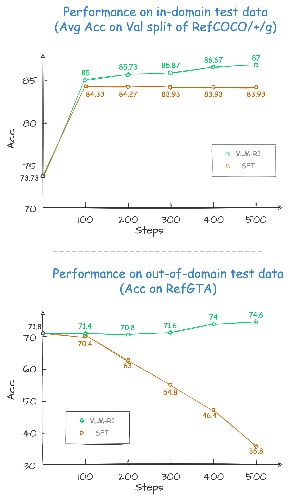
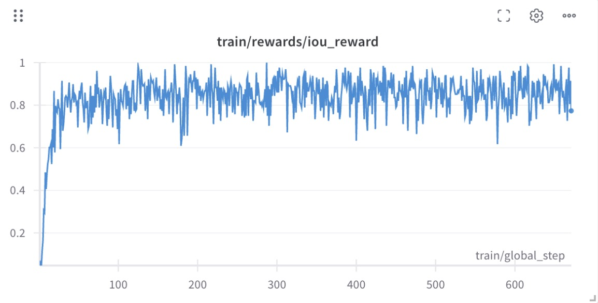
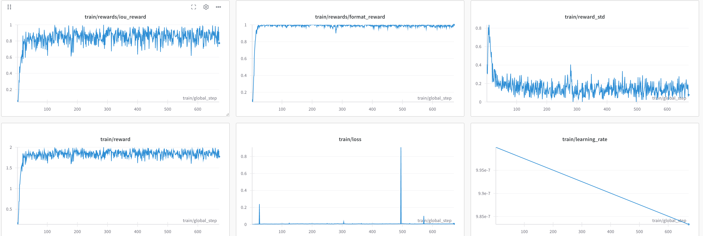
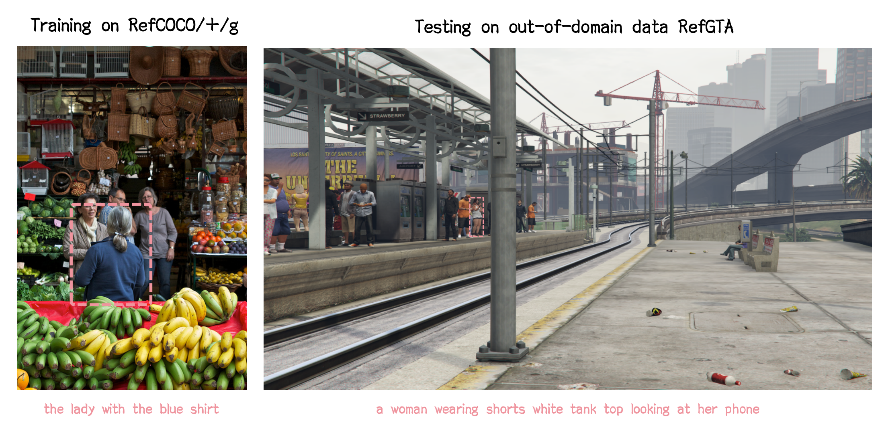

# VLM-R1: A stable and generalizable R1-style Large Vision-Language Model
<font size=4><div align='center' > [[🤗 Demo](https://huggingface.co/spaces/omlab/VLM-R1-Referral-Expression)] </div></font>



Since the introduction of [Deepseek-R1](https://github.com/deepseek-ai/DeepSeek-R1), numerous works have emerged focusing on reproducing and improving upon it. In this project, we propose VLM-R1, a stable and generalizable R1-style Large Vision-Language Model. 

Specifically, for the task of Referring Expression Comprehension (REC), we trained [Qwen2.5-VL](https://github.com/QwenLM/Qwen2.5-VL) using both R1 and SFT approaches. The results reveal that, on the in-domain test data, the performance of the SFT model is slightly lower than that of the R1 model (as shown at the top of the figure above). However, on the out-of-domain test data, the SFT model’s performance deteriorates significantly as the number of steps increases, while the R1 model shows a steady improvement (as shown at the bottom of the figure above).


## Setup

```bash
conda create -n vlm-r1 python=3.10
conda activate vlm-r1
bash setup.sh
```

## Training

### Referring Expression Comprehension (REC)

#### GRPO

> 1. Download the [COCO Train2014 image](https://huggingface.co/datasets/omlab/VLM-R1/resolve/main/train2014.zip) and unzip it, and we refer to the image dir as `<your_image_root>`.

> 2. Download the [RefCOCO/+/g and RefGTA Annotation files](https://huggingface.co/datasets/omlab/VLM-R1/resolve/main/rec_jsons_processed.zip) and unzip it (RefGTA is used for out-of-domain evaluation).

> 3. Write the path of the annotation files in the `src/open-r1-multimodal/data_config/rec.yaml` file.
```bash
datasets:
    - json_path: /path/to/refcoco_train.json
    - json_path: /path/to/refcocop_train.json
    - json_path: /path/to/refcocog_train.json
```

> 4. ```bash src/open-r1-multimodal/run_grpo_rec.sh```

```bash
cd src/open-r1-multimodal

torchrun --nproc_per_node="8" \
    --nnodes="1" \
    --node_rank="0" \
    --master_addr="127.0.0.1" \
    --master_port="12346" \
    src/open_r1/grpo_rec.py \
    --deepspeed local_scripts/zero3.json \
    --output_dir output/$RUN_NAME \
    --model_name_or_path Qwen/Qwen2.5-VL-3B-Instruct \
    --dataset_name data_config/rec.yaml \
    --image_root <your_image_root> \
    --max_prompt_length 1024 \
    --num_generations 8 \
    --per_device_train_batch_size 1 \
    --gradient_accumulation_steps 2 \
    --logging_steps 1 \
    --bf16 \
    --torch_dtype bfloat16 \
    --data_seed 42 \
    --report_to wandb \
    --gradient_checkpointing false \
    --attn_implementation flash_attention_2 \
    --num_train_epochs 2 \
    --run_name $RUN_NAME \
    --save_steps 100 \
    --save_only_model true
```




#### SFT
We use [LLaMA-Factory](https://github.com/hiyouga/LLaMA-Factory) to train the SFT model.
> 1. Clone the [LLaMA-Factory](https://github.com/hiyouga/LLaMA-Factory) repository and install the dependencies.
```bash
git clone https://github.com/hiyouga/LLaMA-Factory.git
cd LLaMA-Factory
pip install -e ".[torch,metrics]"
```

> 2. Download the dataset_info.json, mllm_rec_json.json, and qwen2_5_vl_full_sft.yaml we provided [here](https://huggingface.co/datasets/omlab/VLM-R1/tree/main/sft_related). Put the json files in the `LLaMA-Factory/data` directory and the yaml file in the `LLaMA-Factory/examples/train_full` directory.

> 3. Run the following command to train the SFT model.
```bash
llamafactory-cli train examples/train_full/qwen2_5_vl_full_sft.yaml
```

### For you own data
We also support data loading the jsonl data of this format in [`src/open-r1-multimodal/src/open_r1/grpo_jsonl.py`](src/open-r1-multimodal/src/open_r1/grpo_jsonl.py). Please note that you may need to use different reward functions for your specialized tasks. Welcome to PR to add your own reward functions or share any other interesting findings!

The jsonl has the format as follows:
```json
{"id": 1, "image": "Clevr_CoGenT_TrainA_R1/data/images/CLEVR_trainA_000001_16885.png", "conversations": [{"from": "human", "value": "<image>What number of purple metallic balls are there?"}, {"from": "gpt", "value": "0"}]}
```

Note: The image path in the jsonl file should be relative to the image folder specified in `--image_folders`. The absolute path of the input image is constructed as `os.path.join(image_folder, data['image'])`. For example:
- If your jsonl has `"image": "folder1/image1.jpg"`
- And you specify `--image_folders "/path/to/images/"`
- The full image path will be `/path/to/images/folder1/image1.jpg`

Multiple data files and image folders can be specified using ":" as a separator:
```bash
--data_file_paths /path/to/data1.jsonl:/path/to/data2.jsonl \
--image_folders /path/to/images1/:/path/to/images2/
```

The script can be run like this:
```bash
torchrun --nproc_per_node="8" \
    --nnodes="1" \
    --node_rank="0" \
    --master_addr="127.0.0.1" \
    --master_port="12345" \
  src/open_r1/grpo_jsonl.py \
    --output_dir output/$RUN_NAME \
    --model_name_or_path Qwen/Qwen2.5-VL-3B-Instruct \
    --deepspeed local_scripts/zero3.json \
    --dataset_name <your_dataset_name> \
    --data_file_paths /path/to/your/data.jsonl \ # can be multiple, seperated by ":"
    --image_folders /path/to/your/image/folder/ \ # can be multiple, seperated by ":"
    ...
```
## Evaluation



> 1. Download the provided [RefGTA images](https://huggingface.co/datasets/omlab/VLM-R1/resolve/main/refgta.zip).
```bash
cd ./src/eval

# Remember to change the model path, image root, and annotation path in the script
python test_rec_r1.py # for GRPO
python test_rec_baseline.py # for SFT
```

## Acknowledgements

We would like to express our sincere gratitude to [DeepSeek](https://github.com/deepseek-ai/DeepSeek-R1), [Open-R1](https://github.com/huggingface/open-r1), [QwenVL](https://github.com/QwenLM/Qwen2.5-VL), [Open-R1-Multimodal](https://github.com/EvolvingLMMs-Lab/open-r1-multimodal), [R1-V](https://github.com/Deep-Agent/R1-V), [RefCOCO](https://github.com/lichengunc/refer), and [RefGTA](https://github.com/mikittt/easy-to-understand-REG/tree/master/pyutils/refer2) for providing open-source resources that contributed to the development of this project.


## Citation
If you find this project useful, welcome to cite us.
```bib
@misc{shen2025vlmr1,
  author       = {Shen, Haozhan and Zhang, Zilun and Zhang, Qianqian and Xu, Ruochen and Zhao, Tiancheng},
  title        = {VLM-R1: A stable and generalizable R1-style Large Vision-Language Model},
  howpublished = {\url{https://github.com/om-ai-lab/VLM-R1}},
  note         = {Accessed: 2025-02-15},
  year         = {2025}
}
```
